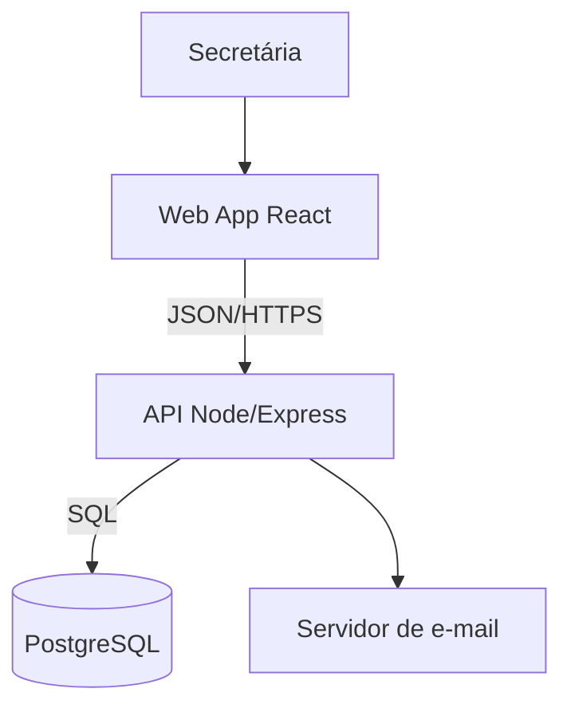

# 15. Arquitetura na prática: C4, ADR, riscos e spikes

> Manual do NES · Volume 7. O plano de ensino pede arquitetura inicial, modelos C4, decisões arquiteturais, atributos de qualidade, riscos e technical spikes. Aqui está como produzir cada um sem virar um projeto paralelo.
> Base conceitual: [[57-O-que-e-arquitetura-de-software]], [[58-MVC-camadas-e-separacao-de-responsabilidades]] e [[59-Monolito-vs-Microsservicos]].

---

## 🎯 O que "arquitetura" quer dizer aqui

Arquitetura é o conjunto de decisões difíceis de mudar depois. Não é diagrama bonito, é responder a três perguntas e registrar as respostas:

1. **Em que pedaços o sistema se divide** e como eles conversam?
2. **Quais qualidades importam mais** neste projeto (rapidez, segurança, acessibilidade, facilidade de manutenção)?
3. **Por que escolhemos assim** e o que aceitamos perder em troca?

Uma equipe de NES precisa de mais ou menos 4 horas de trabalho para produzir tudo isso em versão útil. Passar duas semanas nisso é fugir do código.

---

## 🧭 Atributos de qualidade

Escolha **3 a 5**, no máximo, e dê meta a cada um. Sem meta é slogan, não requisito.

```markdown
## Atributos de qualidade priorizados

| Atributo | Por que importa aqui | Meta verificável |
|---|---|---|
| Usabilidade | A secretária usa o dia inteiro, sem treinamento | Cadastro completo em menos de 5 campos e 2 cliques |
| Desempenho | A busca é usada durante o atendimento por telefone | Resposta em menos de 2s com 5.000 registros |
| Acessibilidade | Exigência da instituição e do plano de ensino | Navegação por teclado e contraste AA nas telas principais |
| Segurança | Dados pessoais de pacientes (LGPD) | Autenticação obrigatória e nenhum dado sensível em log |
| Manutenibilidade | Outra equipe vai continuar o projeto | README que sobe o projeto do zero em 10 minutos |
```

⚠️ Priorizar significa aceitar que os outros atributos ficam em segundo plano. Se tudo é prioridade, nada é.

> Acessibilidade e usabilidade: [[51-Usabilidade-heuristicas-de-Nielsen-e-acessibilidade]]. Segurança e LGPD: [[100-Fundamentos-de-seguranca-e-o-OWASP-Top-10]] e [[101-LGPD-e-privacidade]].

---

## 🏗️ Modelo C4 na dose certa

O C4 tem quatro níveis. **No NES, faça os dois primeiros.** Os outros dois só se a banca pedir.

### Nível 1: Contexto (o sistema e o mundo)

Quem usa e com o que ele conversa. Este diagrama o PO entende, e é o que vai na defesa.

```
        ┌──────────────┐         ┌────────────────────┐
        │  Secretária  │         │      Paciente      │
        └──────┬───────┘         └─────────┬──────────┘
               │ agenda e consulta          │ confirma presença
               ▼                            ▼
        ┌──────────────────────────────────────────────┐
        │        Sistema de Agendamento (nosso)        │
        └───────────────┬──────────────────┬───────────┘
                        │ envia e-mail     │ consulta cadastro
                        ▼                  ▼
              ┌──────────────────┐  ┌─────────────────────┐
              │ Servidor de      │  │ Sistema acadêmico   │
              │ e-mail da UFMS   │  │ existente (externo) │
              └──────────────────┘  └─────────────────────┘
```

### Nível 2: Contêineres (as peças que rodam)

Cada caixa é algo que executa: aplicação web, API, banco, worker.

```
┌─────────────────────────── Sistema de Agendamento ───────────────────────────┐
│                                                                              │
│  ┌────────────────────┐   JSON/HTTPS   ┌──────────────────────┐              │
│  │  Web App           │ ─────────────► │  API REST            │              │
│  │  React + Vite      │                │  Node + Express      │              │
│  │  roda no navegador │ ◄───────────── │  porta 3000          │              │
│  └────────────────────┘                └──────────┬───────────┘              │
│                                                    │ SQL                      │
│                                        ┌───────────▼──────────┐              │
│                                        │  PostgreSQL 16       │              │
│                                        │  container Docker    │              │
│                                        └──────────────────────┘              │
└──────────────────────────────────────────────────────────────────────────────┘
```

💡 **Como desenhar sem sofrer:** ASCII dentro do `docs/arquitetura.md` (versionado e sem ferramenta), ou Mermaid, que o GitHub renderiza sozinho:

````markdown

````

Se preferir clicar, use draw.io ou Excalidraw e **commite o PNG junto do fonte** no repositório.

---

## 📄 ADR: registrar decisões arquiteturais

Um ADR é um arquivo curto, numerado, que responde "por que fizemos assim". É barato de escrever, é exigido pelo plano e é o que te salva quando a banca perguntar o motivo de uma escolha.

`docs/adr/0001-escolha-da-stack.md`:

```markdown
# ADR 0001: Usar Node com Express na API

**Status:** Aceita
**Data:** 2026-08-12
**Decisores:** equipe

## Contexto
Precisamos escolher a linguagem e o framework da API. Quatro dos cinco
integrantes já programaram em JavaScript; ninguém tem prática em Java.
O prazo é de quatro sprints e o proponente não impôs restrição de stack.

## Decisão
Usaremos Node 20 com Express na API e PostgreSQL como banco.

## Alternativas consideradas
- Spring Boot: mais robusto e comum no mercado, mas exigiria a equipe
  aprender Java e Spring durante o projeto.
- Django: bom encaixe, porém só um integrante conhece Python.

## Consequências
Positivas: mesma linguagem no front e no back, curva de aprendizado baixa,
mais tempo disponível para as funcionalidades.
Negativas: menos estrutura pronta que Spring ou Django, então precisamos
definir padrões de camadas por conta própria (ver ADR 0003).
```

**Quando escrever um ADR:** escolha de linguagem, framework, banco, autenticação, hospedagem, padrão de arquitetura, biblioteca importante, ou qualquer decisão que a equipe discutiu por mais de 20 minutos.

**Quando não escrever:** nome de variável, biblioteca pequena e trocável, detalhe de implementação.

⚠️ ADR não se apaga. Se a decisão mudou, crie um novo com status "Aceita" e marque o antigo como "Substituída pela ADR 0007". O histórico das decisões é parte da avaliação.

---

## ⚠️ Registro de riscos

`docs/riscos.md`, revisado no início de cada sprint. Cinco a oito linhas bastam.

```markdown
| # | Risco | Prob. | Impacto | Mitigação | Dono | Status |
|---|-------|-------|---------|-----------|------|--------|
| R1 | Acesso ao servidor de e-mail pode não sair a tempo | Alta | Médio | Implementar com serviço alternativo em ambiente de teste; cobrar o PO toda review | Ana | Aberto |
| R2 | Dois integrantes têm estágio e pouca disponibilidade | Média | Alto | Distribuir tarefas menores para eles; programação em par nas críticas | Bruno | Monitorado |
| R3 | Ninguém da equipe já gerou PDF | Média | Médio | Spike de 4h na Sprint 0 | Carla | Resolvido |
| R4 | Dados pessoais exigem cuidado com LGPD | Baixa | Alto | Autenticação desde a Sprint 1 e nenhum dado sensível em log | Diego | Aberto |
```

🗣️ Levar riscos para a Sprint Review é sinal de maturidade: *"Identificamos que a dependência do e-mail de vocês pode atrasar a entrega; enquanto isso, seguimos com uma alternativa de teste."* Você transforma um problema futuro numa decisão compartilhada.

---

## 🔬 Technical spike

Spike é investigação com prazo, não desenvolvimento. Abra como issue:

```markdown
**Título:** [SPIKE] Como gerar relatório em PDF na nossa stack?

## Pergunta a responder
Conseguimos gerar PDF com layout de tabela a partir da API, sem serviço pago?

## Timebox
4 horas. Encerra em 20/08, independentemente do resultado.

## Critério de conclusão
Um comentário nesta issue com: opção escolhida, como testamos, exemplo
funcionando em branch de teste, e o que recomendamos.

## Resultado (preencher ao fim)
```

Três regras que fazem o spike funcionar:
1. **O prazo é sagrado.** Estourou, encerra com o que tem e registra a conclusão parcial.
2. **O resultado é escrito**, não é "eu vi lá e acho que dá".
3. **O código do spike é descartável.** Ele existe para aprender, não para virar produção.

---

## 🧱 Como decidir a arquitetura em 90 minutos

Roteiro de reunião única, na Sprint 0 (b):

| Tempo | O que fazer |
|---|---|
| 10 min | Listar as restrições: prazo, o que o PO exige, o que a equipe sabe, onde vai rodar. |
| 15 min | Escolher 3 a 5 atributos de qualidade e dar meta a cada um. |
| 20 min | Desenhar o diagrama de contexto e o de contêineres, juntos, na tela. |
| 20 min | Decidir stack, banco, autenticação e hospedagem. Anotar alternativas descartadas. |
| 15 min | Listar riscos e o que precisa virar spike. |
| 10 min | Distribuir: quem escreve cada ADR e o `arquitetura.md` até amanhã. |

⚠️ **Não saia sem dono e prazo para os documentos.** Decisão que só existiu na conversa vira discussão de novo na sprint 2.

---

## ✅ Checklist da fundação técnica

- [ ] `docs/arquitetura.md` com restrições, atributos de qualidade e os diagramas C4 de contexto e contêineres.
- [ ] Pelo menos 2 ADRs escritos (stack e banco costumam ser os primeiros).
- [ ] `docs/riscos.md` com 5 a 8 riscos, cada um com dono e mitigação.
- [ ] `docs/estrategia-de-qualidade.md` dizendo o que será testado e como.
- [ ] `docs/plano-de-releases.md` com o que sai em cada release.
- [ ] Spikes das maiores incertezas abertos, com prazo.
- [ ] Um esqueleto que roda provando que a arquitetura escolhida funciona.

---

> Próximo: [[16-Qualidade-DoD-e-Quality-Gate]].
